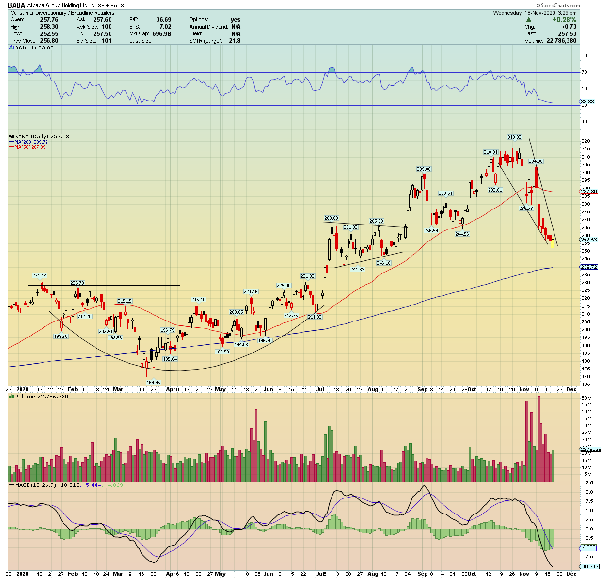

Illustration of cup shaped curves. Ilustration source: http://www.guppytraders.com/gup347.shtml 

<h3> Repo description: </h3> 

The aim of this repo is to provide a set of programming techniques to identify typical TA geomatric shapes.

<b> In construction...</b>
<ul>
<li>Local minimum detection (vertex): </li>
	<ul>
	<li> <strong>local_max_mins.py</strong>: uses <a href ="https://docs.scipy.org/doc/scipy/reference/signal.html">scipy.signals'</a> "argrelextrema" module to find local mins and max</li>
	<li> <strong>local_max_min_Nesovic.py</strong>: here I created my own algorithm to detect different kinds of local mins and max</li>
<li>Convexity Detection</li>
</ul>

</ul>

