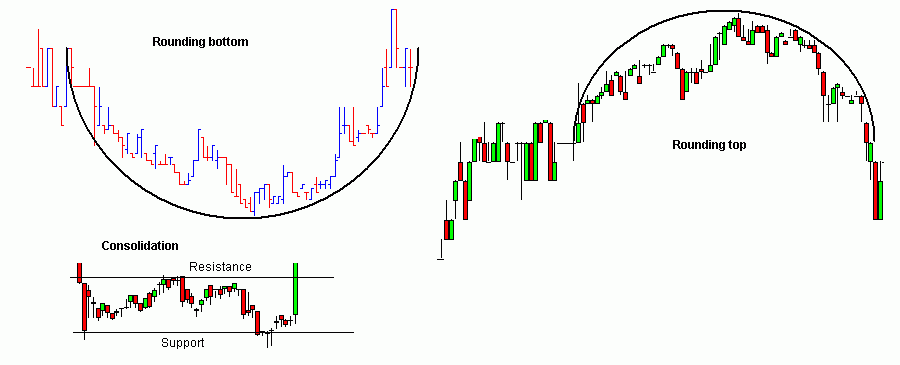
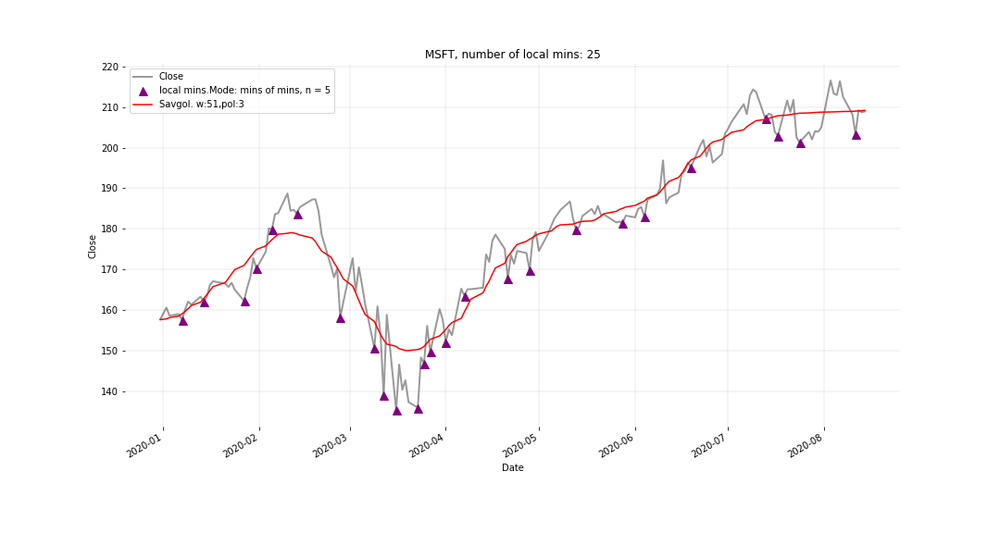

Illustration of cup shaped curves. Ilustration source: http://www.guppytraders.com/gup347.shtml 

<h3> Repo description: </h3>

<ul>
	<li> <strong>local_max_mins.py</strong>: uses <a href ="https://docs.scipy.org/doc/scipy/reference/signal.html">scipy.signals'</a> "argrelextrema" module to find local mins and max</li>
	<li> <strong>local_max_min_Nesovic.py</strong>: here I created my own algorithm to detect different kinds of local mins and max</li>
</ul>

 Example of output of my own algo: 

